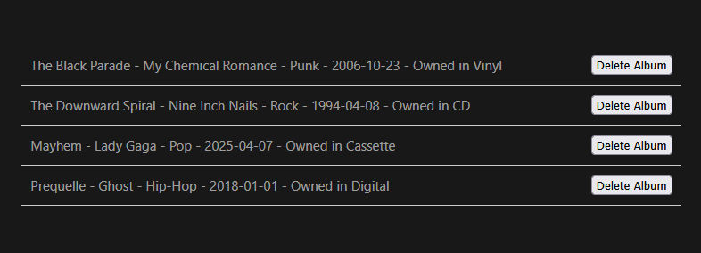

# Music Collection API
A simple RESTful API for managing your music collection, built with ASP.NET using Entity Framework and SQL Server.

## Setup
1. Clone the repository to your local machine:
   ```bash
   git clone https://github.com/AlexKoulel/MusicCollectionAPI
   ```
2. Open the solution in Visual Studio.
3. Inside *appsettings.Development.json*, update the *Server* value in the *MusicCollectionDB* connection string to match your server name.
4. Run the program and use either Postman or your own custom JSON requests.
   - Example POST request:
     ```http
     POST http://localhost:5000/albums
     Content-Type: application/json

     {
         "title": "Prequelle",
         "artist": "Ghost",
         "genreId": 2,
         "releaseDate": "2018-06-01",
         "formatId": 1
     }
     ```
### Frontend Setup
1. Ensure the backend is running.
2. Open a terminal and navigate to the `frontend` folder of the project.
3. Install the required dependencies by running the following command:
   ```bash
   npm install
   ```
4. Start the frontend development server with the command:
   ```bash
   npm run dev
   ```
5. Once the server is up, open the localhost URL displayed in the terminal.
6. The page should load in your browser, resembling the following example: 


## Endpoints

### Albums
| Method | Endpoint      | Description         |
|:-|:-|:-|
| GET    | `/albums`     | Get all albums |
| GET    | `/albums/{id}` | Get album by ID   |
| POST   | `/albums`     | Add a new album|
| PUT    | `/albums/{id}` | Update an existing album|
| DELETE | `/albums/{id}` | Delete an album |

### Genres
| Method | Endpoint| Description|
|:-|:-|:-|
| GET    | `/genres`     | Get all genres |
| GET    | `/genres/{id}` | Get genre  by ID   |
| POST   | `/genres`     | Add a new genre|
| PUT    | `/genres/{id}` | Update an existing genre|
| DELETE | `/genres/{id}` | Delete a genre |

### Formats
| Method | Endpoint| Description|
|:-|:-|:-|
| GET    | `/format`     | Get all formats |
| GET    | `/format/{id}` | Get format by ID   |
| POST   | `/format`     | Add a new format|
| PUT    | `/format/{id}` | Update an existing format|
| DELETE | `/format/{id}` | Delete a format |